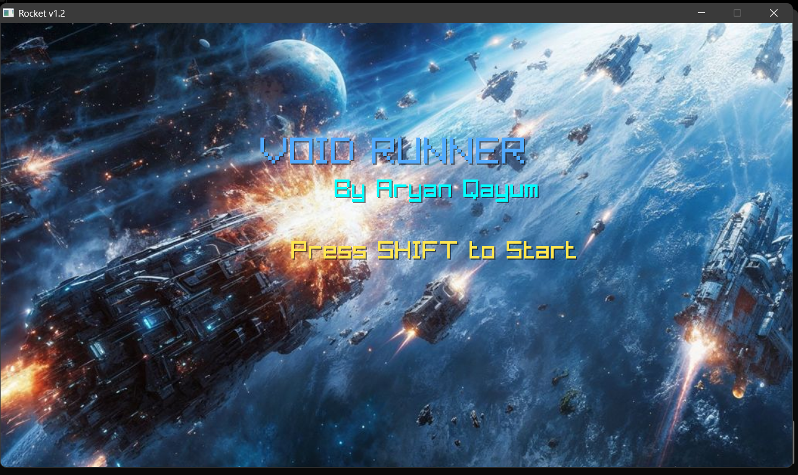
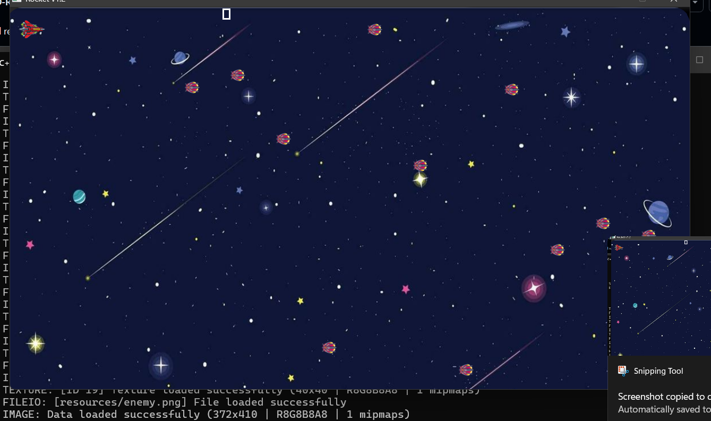
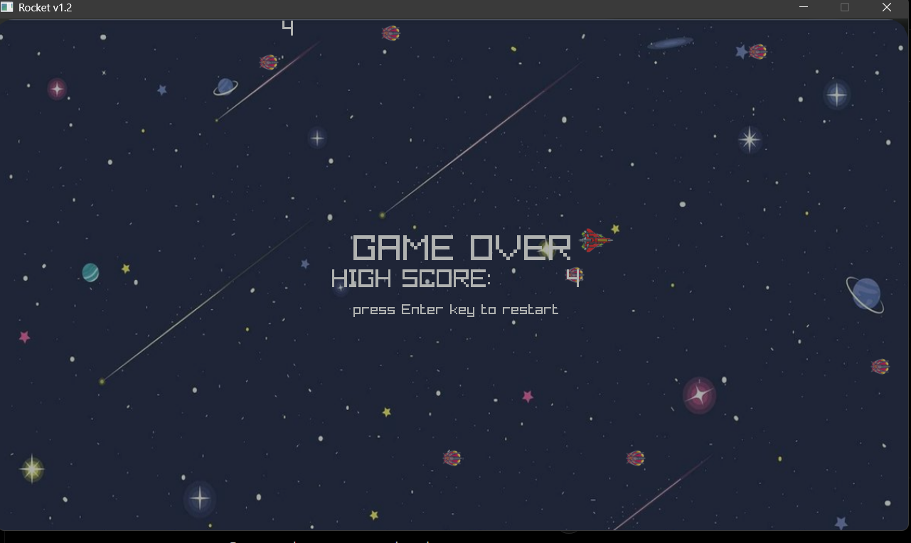

# 🚀 Rocket v1.2 - 2D Retro Rocket Game

A fast-paced 2D retro arcade shooter built using **C++** and **Raylib**. Control your rocket, destroy incoming enemies, survive as long as possible, and achieve the highest score.

---

## 🎮 Gameplay

- Control a rocket using keyboard.
- Shoot enemies before they collide with you.
- Background music and sound effects.
- Increasing difficulty with continuous enemy spawning.
- Score tracking.
- Game Over screen with restart option.

---

## 📸 Screenshots

### Main Menu



### Gameplay



### Game Over



---

## ✨ Features

- 🚀 Smooth player movement
- 🔫 Bullet shooting mechanics
- 👾 Random enemy spawning
- 💥 Collision detection
- 🎵 Background music & sound effects
- 📈 Score counter
- 🎮 Retro arcade experience
- ⚡ Built with Raylib

---

## 🛠 Tech Stack

- C++
- Raylib
- Object-Oriented Programming

---

## 📂 Project Structure

```
Rocket-v1.2/
│
├── resources/
│   ├── rocket.png
│   ├── enemy.png
│   ├── background.png
│   ├── bgAudio.mp3
│   └── ...
│
├── src/
│   ├── main.cpp
│   └── Mobs.hpp
│
├── README.md
└── LICENSE
```

---

## ⌨ Controls

| Key | Action |
|------|--------|
| Arrow Keys | Move Rocket |
| Space | Fire Bullet |
| Enter | Restart Game |
| Shift | Start Game |

---

## ⚙ Installation

### Clone Repository

```bash
git clone https://github.com/EnzoCodes786/2D-Retro-Rocket-Game.git
cd 2D-Retro-Rocket-Game
```

### Requirements

- C++17
- Raylib

### Build

Compile using your preferred compiler.

Example (MinGW):

```bash
g++ src/main.cpp -o Rocket.exe -lraylib -lopengl32 -lgdi32 -lwinmm
```

---

## 🎯 Future Improvements

- Multiple enemy types
- Boss fights
- Power-ups
- Health system
- High score saving
- Particle effects
- Animated explosions

---

## 👨‍💻 Author

**Aryan Qayum**

- GitHub: https://github.com/EnzoCodes786

---

## 📄 License

This project is licensed under the MIT License.
